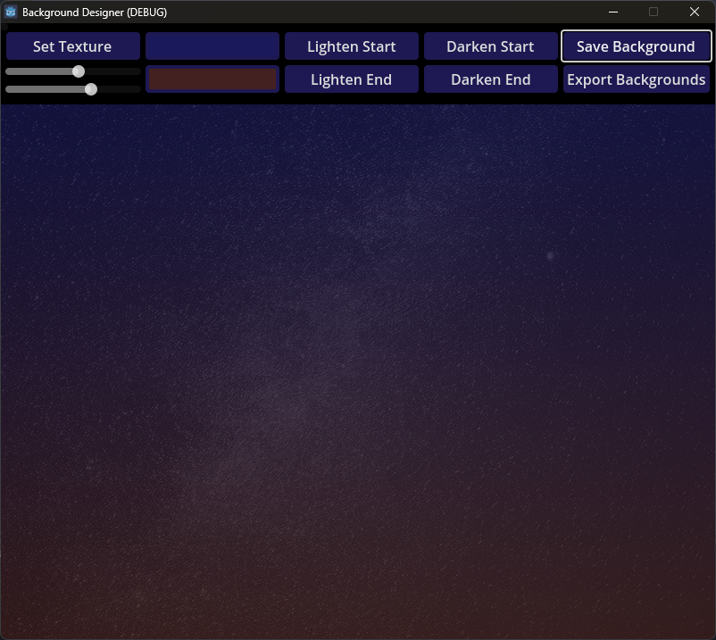
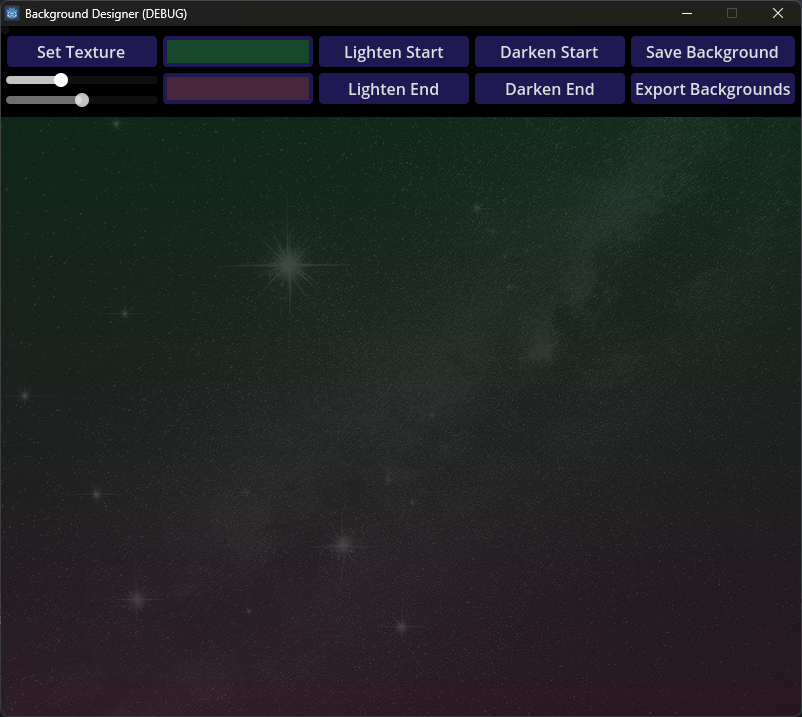

# Background Designer

Had an idea about an easy way to make interesting backgrounds in godot.  Basically it
layers a gradient over an image.  Pretty simple

With this tool you can visually design multiple backgrounds and export the settings
to a Reference file or a JSON file.

This was made as a quick tool for myself but you might find it useful.

The file BackgroundComponent.gd is the one you need to add to your project to use the generated backgrounds.

